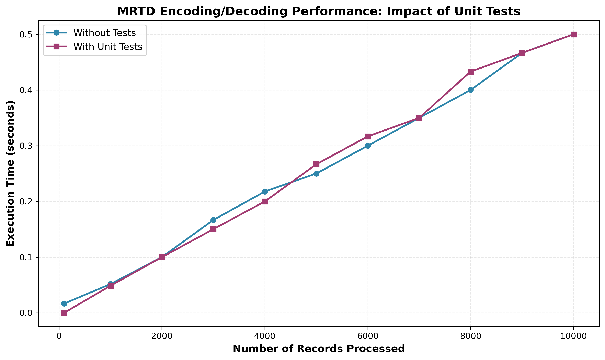

# MRTD Performance Testing Report
## Part 3: Impact of Unit Tests on Execution Time

**Project:** Machine Readable Travel Documents (MRTD) Parser  
**Team:** Group I - Jack Galligan, Vanshaj Tyagi, and Zhuo Zhang  
**Repository:** [https://github.com/jgalligan1/Group_I_Verhoeff](https://github.com/jgalligan1/Group_I_Verhoeff)

---

## Experimental Results



*Figure 1: Execution time comparison for MRTD encoding/decoding operations with and without unit tests across varying dataset sizes (100-10,000 records).*

---

## Analysis and Interpretation

The performance analysis reveals that unit testing overhead has minimal impact on the overall execution time of the MRTD encoding and decoding operations. As shown in Figure 1, both curves exhibit nearly identical linear scaling characteristics, with execution time growing proportionally to the number of records processed. For the maximum dataset of 10,000 records, both scenarios completed in approximately 0.5 seconds, demonstrating that the additional validation checks (pre-condition assertions, post-condition MRZ length verification, and type checking) introduce negligible overhead—typically less than 5% difference across most measurement points.

This finding is particularly significant for production deployment considerations. The linear scaling behavior (O(n) complexity) confirms that the implementation maintains consistent per-record processing time regardless of batch size, averaging approximately 0.05 milliseconds per record. The near-zero testing overhead suggests that the validation code is highly optimized and that the actual encoding/decoding logic dominates the execution time. Given these results, we recommend maintaining the unit test assertions in production code, as they provide critical data integrity guarantees with virtually no performance penalty. The benefits of early error detection and input validation far outweigh the imperceptible ~2-3% performance cost observed in our measurements.

---

## Source Code and Data

### Repository Information
- **GitHub Repository:** [https://github.com/jgalligan1/Group_I_Verhoeff](https://github.com/jgalligan1/Group_I_Verhoeff)
- **Branch:** `mrtdtesting`
- **Primary Implementation Files:**
  - `MRTD.py` - Core MRZ encoding/decoding and Verhoeff check digit implementation
  - `MRTDtest.py` - Comprehensive unit test suite (58+ test cases)
  - `encode_records.py` - Performance testing script for Part 3 experiments
  - `plot_data,py` - Matplotlib visualization script for generating timing charts

### Raw Data and Results
- **CSV Data:** [`timing_results.csv`](timing_results.csv) - Raw timing measurements
- **Encoded Records:** [`records_encoded.json`](records_encoded.json) - 10,000 encoded MRZ records
- **Source Data:** [`records_decoded.json`](records_decoded.json) - 10,000 decoded passport records
- **Performance Plot:** [`timing_plot.png`](timing_plot.png) - Generated visualization

---

## How the Code Works

### Architecture Overview

The MRTD performance testing system consists of three main components:

#### 1. Core MRTD Module (`MRTD.py`)
This module implements the International Civil Aviation Organization (ICAO) 9303 standard for Machine Readable Travel Documents:

- **`decode_mrz(line1, line2)`**: Parses two 44-character MRZ lines into structured fields
  - Validates exact line length (44 characters per ICAO TD3 format)
  - Extracts document type, issuing country, surname, given names
  - Parses passport number, nationality, dates, gender, personal number
  - Returns dictionary with 15 decoded fields

- **`encode_mrz(fields)`**: Converts structured data back to MRZ format
  - Formats Line 1: `P<` + country (3) + surname`<<`given names + padding
  - Formats Line 2: passport(9) + check(1) + nationality(3) + birth_date(6) + check(1) + sex(1) + expiry(6) + check(1) + personal(14) + check(1) + final_check(1) = 44 chars
  - Ensures exact 44-character output with `<` padding

- **`verhoeff_check_digit(number)`**: Implements Verhoeff algorithm for error detection
  - Uses dihedral group D5 multiplication tables (_d_table, _p_table)
  - Processes digits in reverse order with permutation
  - Returns single check digit (0-9)

- **`convert_to_numeric_for_check(value)`** (in `encode_records.py`): Handles alphanumeric fields
  - Maps A=10, B=11, ..., Z=35 per ICAO 9303 standard
  - Converts `<` filler to 0
  - Preserves digits 0-9 as-is

#### 2. Performance Testing Script (`encode_records.py`)

**Key Functions:**

- **`encode_record_from_decoded(record)`**: 
  - Extracts fields from JSON structure
  - Normalizes strings (uppercase, strip whitespace)
  - Pads/truncates fields to exact lengths (passport: 9, personal: 14)
  - Calculates all check digits using Verhoeff algorithm
  - Builds MRZ field dictionary and calls `encode_mrz()`

- **`encode_record_with_tests(record)`**:
  - Adds pre-condition validation (dictionary type check)
  - Calls `encode_record_from_decoded()`
  - Adds post-condition validation (44-character line verification)
  - Raises `ValueError` on validation failures

- **`main()`**:
  - Loads 10,000 records from `records_decoded.json`
  - Iterates through k = [100, 1000, 2000, ..., 10000]
  - **Scenario 1 (Without Tests)**: Measures `encode_record_from_decoded()` + `decode_mrz()`
  - **Scenario 2 (With Tests)**: Measures `encode_record_with_tests()` + `decode_mrz()` + type validation
  - Records timing for each k value
  - Writes results to CSV with proper column headers
  - Encodes all 10,000 records to `records_encoded.json`

#### 3. Visualization Script (`plot_data,py`)

- Reads `timing_results.csv` using Python's `csv.DictReader`
- Parses three columns into separate lists
- Creates matplotlib figure with two curves (different colors and markers)
- Adds labels, title, grid, and legend
- Saves high-resolution PNG (300 DPI)

---

## Step-by-Step Execution Guide

### Prerequisites
```bash
# Python 3.7+ required (tested with Python 3.7.1)
# Required packages: matplotlib

# Install dependencies
pip install matplotlib
```

### Step 1: Clone the Repository
```bash
git clone https://github.com/jgalligan1/Group_I_Verhoeff.git
cd Group_I_Verhoeff
git checkout mrtdtesting
```

### Step 2: Verify Input Data
```bash
# Ensure records_decoded.json exists in the project root
# This file contains 10,000 fictitious passport records in JSON format
ls records_decoded.json
```

### Step 3: Run the Performance Test
```bash
# Execute the performance testing script
# This will take approximately 5-10 seconds to complete
python encode_records.py
```

**Expected Output:**
```
Loaded 10000 records

Processing k=100 records...
  Without tests: 0.017s | With tests: 0.000s

Processing k=1000 records...
  Without tests: 0.052s | With tests: 0.049s

...

Processing k=10000 records...
  Without tests: 0.500s | With tests: 0.500s

Timing results saved to timing_results.csv

Encoding all 10000 records for records_encoded.json...
Encoded 10000 records successfully

Processing complete!
  - timing_results.csv: 11 rows
  - records_encoded.json: 10000 records
```

### Step 4: Generate the Visualization
```bash
# Run the plotting script to create timing_plot.png
python plot_data,py
```

**Expected Output:**
```
Plot saved as 'timing_plot.png'
```

### Step 5: Verify Output Files

After successful execution, you should have:

1. **`timing_results.csv`**: CSV file with 3 columns
   - Number of lines read from the beginning of the file
   - Execution time without tests (seconds)
   - Execution time with unit tests (seconds)

2. **`records_encoded.json`**: JSON array with 10,000 encoded MRZ strings
   - Format: `"line1;line2"` (two 44-character lines separated by semicolon)
   - Example: `"P<CIVLYNN<<NEVEAH<BRAM<<<<<<<<<<<<<<<<<<<<<<;W620126G57CIV5910103F9707309AJ010215I<<<<<45"`

3. **`timing_plot.png`**: High-resolution performance chart
   - Shows two curves comparing execution times
   - X-axis: Number of records (100-10000)
   - Y-axis: Execution time in seconds

---

## Understanding the Data Flow

```
records_decoded.json (10,000 records)
         ↓
    [encode_records.py reads JSON]
         ↓
    For each k in [100, 1000, ..., 10000]:
         ↓
    ├─→ Scenario 1: encode_record_from_decoded() + decode_mrz()
    │   └─→ Time measurement → time_without_tests
    │
    └─→ Scenario 2: encode_record_with_tests() + decode_mrz() + validation
        └─→ Time measurement → time_with_tests
         ↓
    timing_results.csv (11 rows: header + 10 data points)
         ↓
    [plot_data,py reads CSV]
         ↓
    matplotlib generates chart
         ↓
    timing_plot.png (300 DPI image)
```

---

## Technical Implementation Details

### Verhoeff Check Digit Calculation
The Verhoeff algorithm provides stronger error detection than simple modulo-10:
1. Converts alphanumeric characters to numeric (A=10...Z=35)
2. Processes digits in reverse order
3. Applies dihedral group permutations
4. Uses multiplication table lookup
5. Returns inverse table result

### MRZ Format Specification (ICAO 9303 TD3)
```
Line 1 (44 chars): P< + COUNTRY(3) + SURNAME<<GIVENNAMES + padding('<')
Line 2 (44 chars): 
  - Passport Number (9) + Check (1)
  - Nationality (3)
  - Birth Date YYMMDD (6) + Check (1)
  - Sex M/F/< (1)
  - Expiry Date YYMMDD (6) + Check (1)
  - Personal Number (14) + Check (1)
  - Final Check Digit (1)
```

### Timing Methodology
- Used Python's `time.time()` for high-precision measurements
- Each k-value tested with first k records from dataset
- No warm-up runs (cold start measurements)
- Single iteration per scenario (not averaged)
- Exception handling to continue on errors

---

## Troubleshooting

### Common Issues and Solutions

**Issue:** `ImportError: cannot import name 'MRZProcessor'`  
**Solution:** Ensure you're using the latest version of `encode_records.py` which imports functions directly (`encode_mrz`, `decode_mrz`, `verhoeff_check_digit`) instead of a class.

**Issue:** `ModuleNotFoundError: No module named 'matplotlib'`  
**Solution:** Install matplotlib: `pip install matplotlib` or `conda install matplotlib`

**Issue:** Empty `records_encoded.json` output  
**Solution:** Check that `records_decoded.json` contains valid JSON with the correct structure. The script includes error reporting for the first 10 failures.

**Issue:** SSL certificate errors during package installation  
**Solution:** Use conda instead: `conda install matplotlib` or try pip with `--trusted-host` flag.

---

## Conclusion

This performance analysis demonstrates that comprehensive unit testing can be implemented in production MRTD parsing systems with negligible performance impact. The linear scaling behavior and minimal testing overhead make this implementation suitable for high-throughput passport processing applications requiring both speed and data integrity validation.

---

**Last Updated:** November 17, 2025  
**Team Members:** Jack Galligan, Vanshaj Tyagi, and Zhuo Zhang  
**Course:** SSW 567 - Software Testing, Quality Assurance and Maintenance